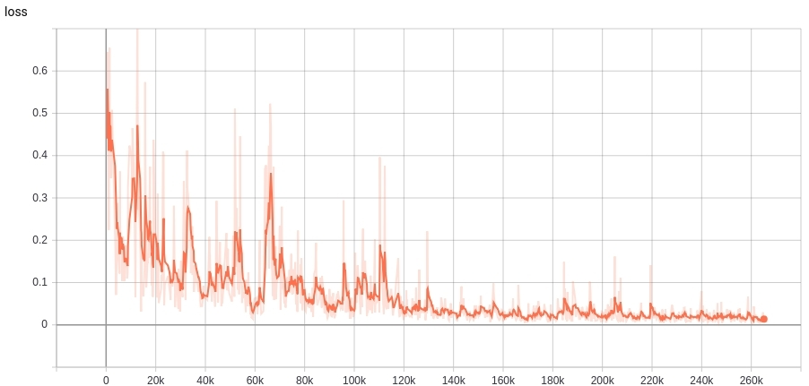

# Challenging the generalization capabilities of Graph Neural Networks for network modeling
#### Demo paper in ACM SIGCOMM Posters and Demos 2019, Beijin, China.
#### Link to paper: [[here](https://dl.acm.org/citation.cfm?id=3342327)]
#### J. Suárez-Varela, S. Carol-Bosch, K. Rusek, P. Almasan, M. Arias, P. Barlet-Ros, A. Cabellos-Aparicio.
#### Contact mailing list: kdn-users@knowledgedefinednetworking.org
(You first need to subscribe at: https://mail.knowledgedefinednetworking.org/cgi-bin/mailman/listinfo/kdn-users).


## Abstract
Today, network operators still lack functional network models able to make accurate predictions of end-to-end Key Performance Indicators (e.g., delay or jitter) at limited cost. Recently, a novel Graph Neural Network (GNN) model called RouteNet was proposed as a cost-effective alternative to estimate the per-source/destination pair mean delay and jitter in networks. Thanks to its GNN architecture that operates over graph-structured data, RouteNet revealed an unprecedented ability to learn and model the complex relationships among topology, routing and input traffic in networks. As a result, it was able to make performance predictions with similar accuracy than resource-hungry packet-level simulators even in network scenarios unseen during training. In this demo, we challenge the generalization capabilities of RouteNet with more complex scenarios, including larger topologies.
 
<!-- Add BibTex citation to paper -->
 
## Description
In this demo, we extended the original implementation of RouteNet to support different link capacities. The code of RouteNet used in the demo is available on the ['code' directory](code).

The following figure shows a schematic representation of the internal architecture of RouteNet. In this implementation, the input per-source/destination traffic is provided in the initial path states, while the link capacity is added as an input feature in the initial link states.

<p align="center"> 
  
</p>
<p align="center"> 
    <em>Internal architecture of RouteNet</em>
</p>

All the datasets used in the demo are available in the following [repository](https://github.com/knowledgedefinednetworking/NetworkModelingDatasets/tree/master/datasets_v0). This repository includes a detailed description on how to process the datasets.
 
Moreover, we provide a RouteNet model already trained (in the ['trained_models' directory](trained_models)) that can be directly loaded to make accurate per-source/destination delay predictions on any sample from our datasets. In particular, this model was trained over 480,000 training samples: 240,000 from the 14-node NSF network topology and 240,000 from a 50-node synthetically-generated topology. You can find more details about the topologies and the training samples used in the [dataset repository](https://github.com/knowledgedefinednetworking/NetworkModelingDatasets/tree/master/datasets_v0).

Lastly, we provide a Jupyter notebook that loads our model already trained and makes per-source/destination delay predictions over arbitrary samples of our datasets (in the [demo_notebooks directory](demo_notebooks)).

## Running RouteNet

In order to facilitate the execution of RouteNet, we provide some example functions in the script **[run_routenet.sh](code/run_routenet.sh)**. This script contains different calls to the RouteNet code (**[routenet_with_link_cap.py](code/routenet_with_link_cap.py)**). Also, they provide some predefined hyperparameters that can be easily modified in the script.


## 'How to' guide
First of all, you can prepare the Python environment for the demo executing the following command:

```
pip install -r requirements.txt
```

This command installs all the dependencies needed to execute RouteNet.

To train and evaluate RouteNet it is necessary to download some datasets from the [dataset repository](https://github.com/knowledgedefinednetworking/NetworkModelingDatasets/tree/master/datasets_v0). In this repository you can find three datasets with samples simulated with a packet-level simulator (OMNet++) in three different topologies: NSFNET (2GB), GEANT2 (6GB)
and synthetic 50 nodes (28.7GB) topologies. To download and decompress the three datasets you can use the following commands:

```
wget "http://knowledgedefinednetworking.org/data/datasets_v0/nsfnet.tar.gz"
wget "http://knowledgedefinednetworking.org/data/datasets_v0/geant2.tar.gz"
wget "http://knowledgedefinednetworking.org/data/datasets_v0/synth50.tar.gz"
tar -xvzf nsfnet.tar.gz 
tar -xvzf geant2.tar.gz 
tar -xvzf synth50.tar.gz
```

Note that it is not necessary to download the three datasets to start to play with RouteNet. For instance, you can start using only the NSFNET dataset. Once you have downloaded the datasets, the next step is to create a Linux environment Global variable that points to the directory where you downloaded the datasets. For example, if the 'wget' command was executed in the directory '/home/Downloads/datasets', the Global variable can be defined as follows:

```
PATH_TO_DATASET='/home/Downloads/datasets'
export PATH_TO_DATASET
```

:warning: **An incorrect definition of the environment variable PATH_TO_DATASET will lead to execution errors**: Make sure it points to the proper directory!

Then, you may use the script [run_routenet.sh](code/run_routenet.sh) to train a RouteNet model that predicts the per-source/destination delay. In order to train RouteNet it is necessary to convert the datasets to the 'TFRecords' format of TensorFlow. Our datasets provide directly the TFRecords files that we used to train and evaluate RouteNet (in the subdirectories 'tfrecords/train' and 'tfrecords/evaluate') in the demo. So, if you only want to reproduce the experiments of our demo you can skip this step. Otherwise, you can generate new TFrecords files running the following commands correspondingly for the three different datasets we provide:

```
./run_routenet.sh tfrecords nsfnetbw
./run_routenet.sh tfrecords geant2bw
./run_routenet.sh tfrecords synth50bw
```


Now, everything is ready to train a RouteNet model. For instance, you can use the following command to train a model using samples just from one topology:

```
./run_routenet.sh train nsfnetbw 50000
```

In this case, RouteNet is trained over the training datasets of NSFNET and evaluated over the evaluation samples of the same topology. Note that 'nsfnetbw' can be replaced in this command by 'geant2bw' or 'synth50bw' to train the model with the training and evaluation samples of the two other topologies.

This implementation of RouteNet has support to be trained with samples from topologies of variable size. For instance, you can execute the command below to train a model with samples from the NSFNET and the 50-node topology:

```
./run_routenet.sh train_multiple nsfnetbw synth50bw output_logdir 100000
```

By default, the evaluation is done on the entire GEANT2 dataset (train and evaluation TFRecords). However, it can be easily modified
by setting the paths provided in the '--eval_' flag of the 'train_multiple' function in the script [run_routenet.sh](code/run_routenet.sh).


Once the training is executed, one may use TensorBoard to observe the evolution of some relevant statistics such as the loss, the evaluation accuracy or the values of the weights and gradients along the training. This may be very helpful to identify some possible issues during the training. To execute Tensorboard you can use the following command:

```
tensorboard --logdir <path_to_logs>
```

Assuming that you used the training functions provided above, the [run_routenet.sh](code/run_routenet.sh) script stores the output logs in subdirectories within the './CheckPoints/' directory.

Then, you can connect in a web browser to 'http://localhost:6006/' and see the logs via a web application.

As an example, we provide below two figures that show the evolution of the loss (Mean Absolute Error) and the accuracy (Pearson correlation coefficient) of the RouteNet model that is provided in the ['trained_models' directory](trained_models).

<p align="center"> 
  
</p>
<p align="center"> 
    <em>Loss of the model w.r.t. the training steps</em>
</p>

<p align="center"> 
  
</p>
<p align="center"> 
    <em>Pearson correlation coefficient of the model w.r.t. the training steps</em>
</p>

This model was trained with samples of the 14-node NSFNET and the 50-node topologies, and was evaluated over samples of the Geant2 topology.

## Demo notebook

In order to continue playing with RouteNet, you can follow an interactive Jupyter notebook that we provide in the [demo_notebooks directory](demo_notebooks). Here, we load the RouteNet model in the [trained_models directory](trained_models) to make per-source/destination delay predictions and show some plots that illustrate how we can leverage the delay predictions of RouteNet for network visibility.
